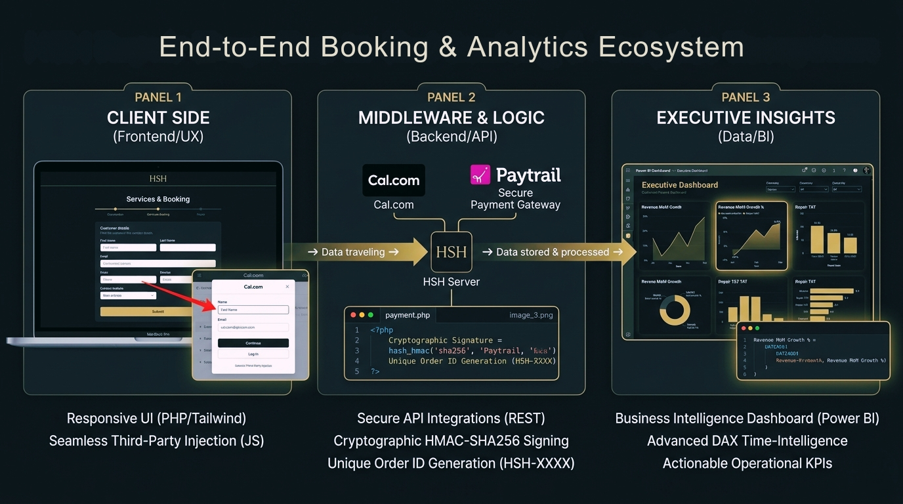

Power BI / DAX measures for professional BI dashboards, featuring advanced time intelligence and statistical segmentation.
# Business Intelligence & Performance Metrics (Power BI / DAX)

## Project Overview
This repository contains advanced **DAX (Data Analysis Expressions)** logic designed to power interactive Power BI dashboards. The measures focus on three critical pillars of Business Intelligence: **Financial Growth**, **Operational Efficiency**, and **Customer Segmentation**. 

These metrics translate raw transactional data into actionable insights, enabling stakeholders to monitor real-time performance and make data-driven strategic decisions.

## Key Analytical Concepts Demonstrated
* **Time Intelligence:** Month-over-Month (MoM) revenue growth analysis using `CALCULATE` and `DATEADD`.
* **Advanced Aggregations:** Dynamic revenue calculation utilizing `SUMX` for row-level precision.
* **Operational KPIs:** Turnaround Time (TAT) analysis to measure workshop throughput and logistics efficiency.
* **Statistical Segmentation:** Dynamic "VIP" client flagging using `PERCENTILE.INC` for automated customer tiering.
* **Ratio Analysis:** Delivery preference metrics using `DIVIDE` for error-safe calculations.

## Business Value & Application
In a high-growth environment, tracking static numbers is not enough. This logic provides:
1. **Performance Context:** By comparing current revenue against the previous month, the business can immediately identify growth trends or seasonal dips.
2. **Bottleneck Identification:** Measuring the average days from pickup to delivery allows management to optimize logistics and improve customer satisfaction.
3. **Marketing Precision:** Automated customer segmentation enables targeted marketing campaigns focused on high-value clients (VIPs).
4. **Data-Driven Strategy:** Identifying the utilization rate of premium services (Pickups) informs resource allocation and pricing strategies.

## Featured Measures
* `Total Revenue`: Comprehensive financial tracking.
* `Revenue MoM Growth %`: Dynamic performance comparison.
* `Avg Turnaround Days`: Core operational KPI.
* `Is High Value Client`: Advanced statistical classification.
  

